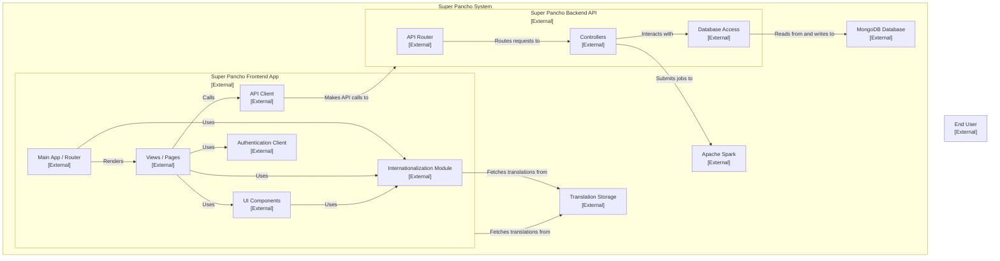

# Unnamed CodeViz Diagram

```mermaid
graph TD

    container_diagram.cv::user["End User<br>[External]"]
    subgraph container_diagram.cv::super_pancho_system["Super Pancho System<br>[External]"]
        container_diagram.cv::mongodb["MongoDB Database<br>[External]"]
        container_diagram.cv::apache_spark["Apache Spark<br>[External]"]
        container_diagram.cv::translation_storage["Translation Storage<br>[External]"]
        subgraph container_diagram.cv::backend_api["Super Pancho Backend API<br>[External]"]
            container_diagram.cv::api_router["API Router<br>[External]"]
            container_diagram.cv::controllers["Controllers<br>[External]"]
            container_diagram.cv::database_access["Database Access<br>[External]"]
            %% Edges at this level (grouped by source)
            container_diagram.cv::api_router["API Router<br>[External]"] -->|"Routes requests to"| container_diagram.cv::controllers["Controllers<br>[External]"]
            container_diagram.cv::controllers["Controllers<br>[External]"] -->|"Interacts with"| container_diagram.cv::database_access["Database Access<br>[External]"]
        end
        subgraph container_diagram.cv::frontend_app["Super Pancho Frontend App<br>[External]"]
            container_diagram.cv::main_app_router["Main App / Router<br>[External]"]
            container_diagram.cv::ui_components["UI Components<br>[External]"]
            container_diagram.cv::views_pages["Views / Pages<br>[External]"]
            container_diagram.cv::api_client["API Client<br>[External]"]
            container_diagram.cv::auth_client["Authentication Client<br>[External]"]
            container_diagram.cv::i18n_module["Internationalization Module<br>[External]"]
            %% Edges at this level (grouped by source)
            container_diagram.cv::main_app_router["Main App / Router<br>[External]"] -->|"Renders"| container_diagram.cv::views_pages["Views / Pages<br>[External]"]
            container_diagram.cv::main_app_router["Main App / Router<br>[External]"] -->|"Uses"| container_diagram.cv::i18n_module["Internationalization Module<br>[External]"]
            container_diagram.cv::views_pages["Views / Pages<br>[External]"] -->|"Uses"| container_diagram.cv::ui_components["UI Components<br>[External]"]
            container_diagram.cv::views_pages["Views / Pages<br>[External]"] -->|"Calls"| container_diagram.cv::api_client["API Client<br>[External]"]
            container_diagram.cv::views_pages["Views / Pages<br>[External]"] -->|"Uses"| container_diagram.cv::auth_client["Authentication Client<br>[External]"]
            container_diagram.cv::views_pages["Views / Pages<br>[External]"] -->|"Uses"| container_diagram.cv::i18n_module["Internationalization Module<br>[External]"]
            container_diagram.cv::ui_components["UI Components<br>[External]"] -->|"Uses"| container_diagram.cv::i18n_module["Internationalization Module<br>[External]"]
        end
        %% Edges at this level (grouped by source)
        container_diagram.cv::database_access["Database Access<br>[External]"] -->|"Reads from and writes to"| container_diagram.cv::mongodb["MongoDB Database<br>[External]"]
        container_diagram.cv::controllers["Controllers<br>[External]"] -->|"Submits jobs to"| container_diagram.cv::apache_spark["Apache Spark<br>[External]"]
        container_diagram.cv::api_client["API Client<br>[External]"] -->|"Makes API calls to"| container_diagram.cv::backend_api["Super Pancho Backend API<br>[External]"]
        container_diagram.cv::i18n_module["Internationalization Module<br>[External]"] -->|"Fetches translations from"| container_diagram.cv::translation_storage["Translation Storage<br>[External]"]
        container_diagram.cv::frontend_app["Super Pancho Frontend App<br>[External]"] -->|"Fetches translations from"| container_diagram.cv::translation_storage["Translation Storage<br>[External]"]
    end

```
---
*Generated by [CodeViz.ai](https://codeviz.ai) on 11/18/2025, 1:07:52 PM*
